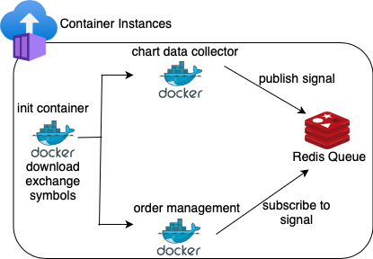

# Trading Bot
[](https://github.com/prabhuwk/trading-bot/actions/workflows/main.yaml)


## Container Instances


# For development

```bash
$ cat .env
DEBUG="True"
DHAN_CLIENT_ID="replace_client_id"
DHAN_ACCESS_TOKEN="replace_access_token"
$ docker-compose up --build
```
Click Run & Debug -> Select 'Python: Remote Attach'
