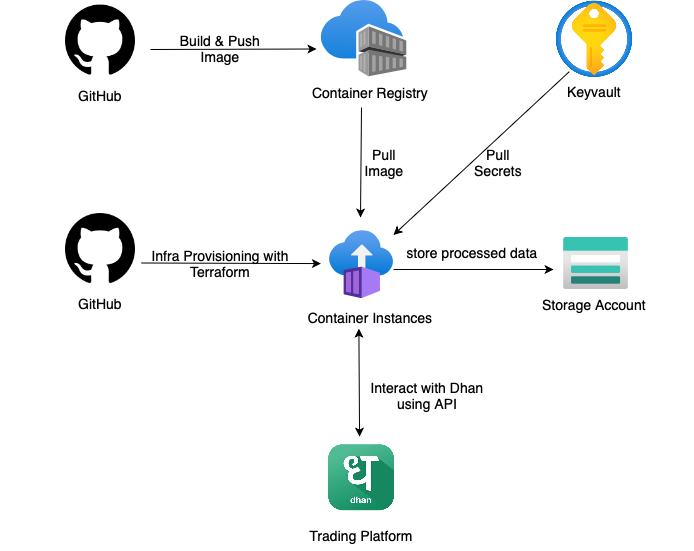

# Trading Bot
[](https://github.com/prabhuwk/trading-bot/actions/workflows/main.yaml)



# For development

```bash
$ cat .env
DEBUG="True"
CLIENT_ID="replace_client_id"
ACCESS_TOKEN="replace_access_token"
$ docker-compose up --build
```
Click Run & Debug -> Select 'Python: Remote Attach'
